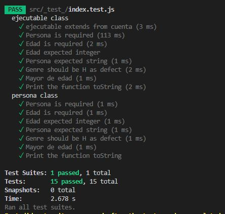

## Reto para el curso de programación orientada objetos, debes realizar el ejercicio en el lenguaje de tú preferencia.
## 1. Crea una clase llamada Persona.
## 2. Crea una Clase llamada Ejecutable (donde ejecutaras los metodos de la clase persona)
La clase Persona tendrá los siguientes atributos: nombre, edad, DNI, sexo (H hombre, M mujer), peso y altura. La clase Ejecutable es la que ejecutara los metodos esMayorDeEdad & comprobarSexo.
- Por defecto, todos los atributos menos el DNI serán valores por defecto según su tipo (0 números, cadena vacía para String, etc.). Sexo sera hombre por defecto, usa una constante para ello.
debes de implantar varios constructores:
- Un constructor por defecto.
- Un constructor con el nombre, edad y sexo, el resto por defecto.
- Un constructor con todos los atributos como parámetro.
Los métodos que se implementaran son:
- esMayorDeEdad(): indica si es mayor de edad, devuelve un booleano (manejar encapsulamiento).
- comprobarSexo(char sexo): comprueba que el sexo introducido es correcto. Si no es correcto, sera H. No sera visible al exterior.
- toString(): devuelve toda la información del objeto.

## Ahora, en la clase ejecutable haz lo siguiente:

- Pide por teclado el nombre, la edad, sexo, peso y altura.
- Crea 3 objetos de la clase anterior, el primer objeto obtendrá las anteriores variables pedidas por teclado, el segundo objeto obtendrá todos los anteriores menos el peso y la altura y el último por defecto, para este último utiliza los métodos set para darle a los atributos un valor.
- Indicar para cada objeto si es mayor de edad.
- Por último, mostrar la información de cada objeto.

## 3. Test

